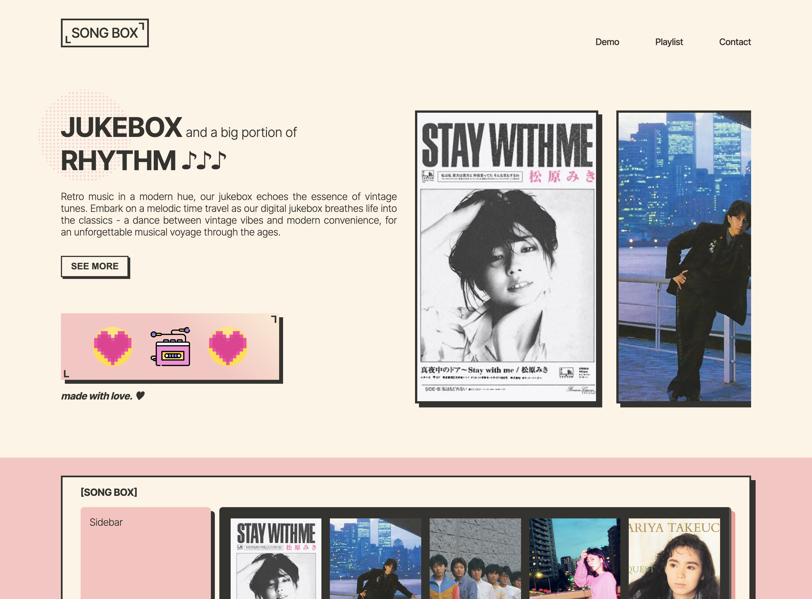

<!-- ABOUT THE PROJECT -->

## About The Project

Welcome to SONG BOX - the Retro Jukebox Web App repository! This project aims to create a nostalgic yet modern web application inspired by classic jukeboxes, offering users an immersive experience into the world of vintage music.

### Overview:

This Retro Jukebox Web App allows users to:

- Browse and select songs spanning various eras and genres.
- Create personalized playlists reminiscent of classic jukebox experiences.
- Experience a blend of vintage aesthetics with modern, user-friendly design elements.

### Features

- Extensive Music Library Demo: Offer a vast collection of songs spanning different genres and eras. Users should be able to explore and select from a catalog of retro tracks, ensuring a diverse musical experience.
- Search and Filter Options: Help users navigate the extensive music library efficiently. Allow users to search by artist, album, genre, or decade for quick access to desired tracks.
- Timeless Playlist Creation: Curate playlists from an extensive library of retro tracks effortlessly.
- Vintage Visuals, Modern Convenience: Enjoy a visually appealing interface with nods to classic jukeboxes while ensuring ease of use across devices.

### Getting Started

To run the Retro Jukebox Web App locally, follow these steps:

1. Clone this repository.
2. Install dependencies using npm install.
3. Run the app using npm start.
   Access the app via your browser at http://localhost:3000.

### Built With

- ReactJS

<!-- ROADMAP -->

## Roadmap

- [x] Design and Create Feel & Look of the WebApp
- [x] Play & Pause Audio in the Overview Section
- [x] Toggle "Playlist View" & "Playing Song View" in the Demo Section
- [ ] Fetch Music from API
- [ ] Add Songs to Playlist Page
- [ ] Search & Filter Options
- [ ] Others

<!-- CONTACT -->

Instagram - [@haz_pro99](https://www.instagram.com/haz_pro99/)

Project Link: [-](https://github.com/your_username/repo_name)

<!-- ACKNOWLEDGMENTS -->
